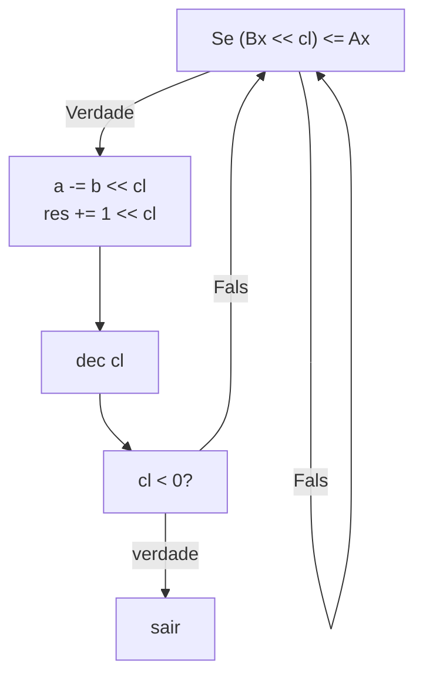

# Divisao

## Vars iniciais

res = 0, resultdo
$Ax : Bx$  
$Cl = 15$ (numero de bits)


## Algoritmo


## Implementacao

```
	dvs proc ;resultado guardado em res e resto no Ax TODO fazer de res uma var local
             ;so funciona para numeros positivos
             
        mov cl,15
        mov res,0
        
        div_BgLoop1:
        mov dx,bx
        shl dx,cl
        cmp dx,ax
        ja  end_if1
            
            sub ax,dx
            mov dx,1
            shl dx,cl
            add res,dx
         
        end_if1:
        dec cl
        jns div_BgLoop1
        div_EndLoop1:
        ret
        
    endp

```