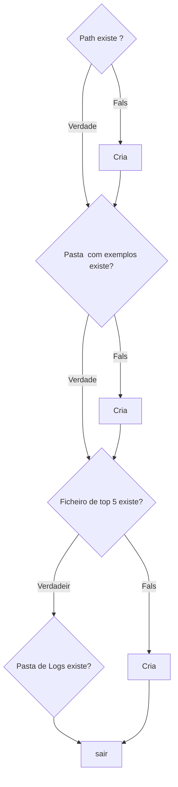

```mermaid
graph
a{"Path existe ?"};
b{"Pasta  com exemplos existe?"}
c{"Ficheiro de top 5 existe?"}
d{"Pasta de Logs existe?"}
e[Cria]
a--Verdade-->b;
e-->b
a--Falso-->e;
b--Verdade-->c;
b--Falso-->e2[Cria];
e2-->c
c--Verdadeiro-->d
c--Falso-->e3[Cria];
d-->sair
e3-->sair
```

