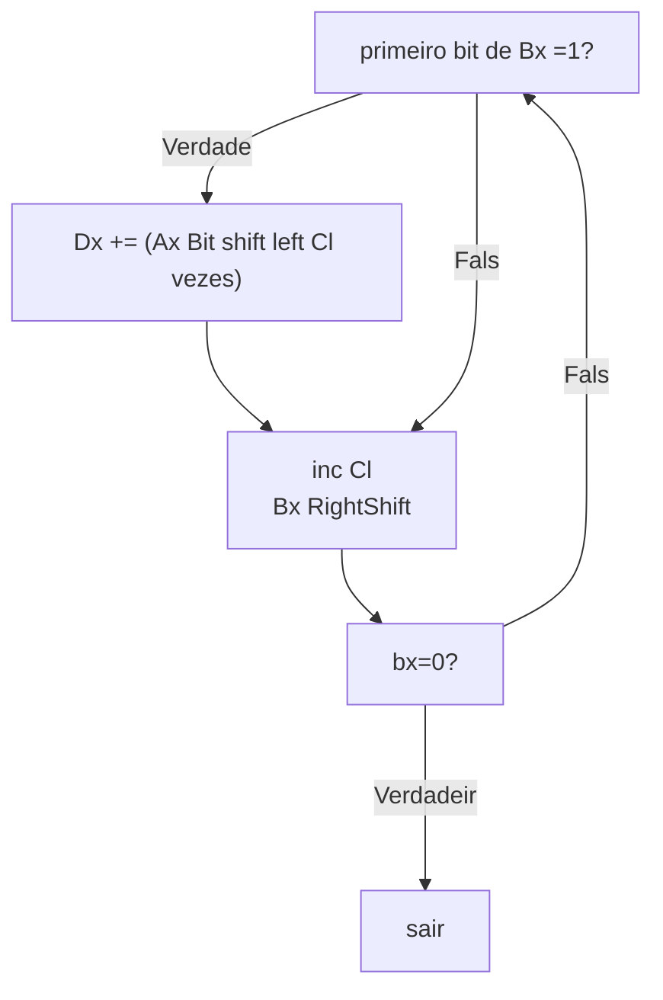

# Algoritmo
$Ax \times Bx = Dx$

## Vars iniciais 

$Ax=$ numero maior
$Bx =$ numero menor
$Cl=$ conta os ciclos
$Dx=$ Guarda o resultado

## Algoritmo




## Implementaoçao

```
    mlt proc ;multiplica Ax e Bx resultado em Dx, Cl usado
        
        ;para que Ax > Bx
        
        cmp ax,bx 
        
        ja mlt_if1
        
        mov dx,ax   ;trocar os valores em bx com ax 
        mov ax,bx
        mov bx,dx
                
        mlt_if1:
        
        mov dx,0 
        mov cl,0
        
        mlt_BgLp1:
            
            mov ch,bl
            and ch,1
            jz mlt_If2;faz o shift se o numero for impar         
            
            shl ax,cl ;bit shift
            add dx,ax        
            
            mlt_If2:
            
            inc cl
            shr bx,1
        
        or bx,bx     ;ativa as flags para o numero em bx
        jnz mlt_BgLp1          
            
        ret
    endp
```
