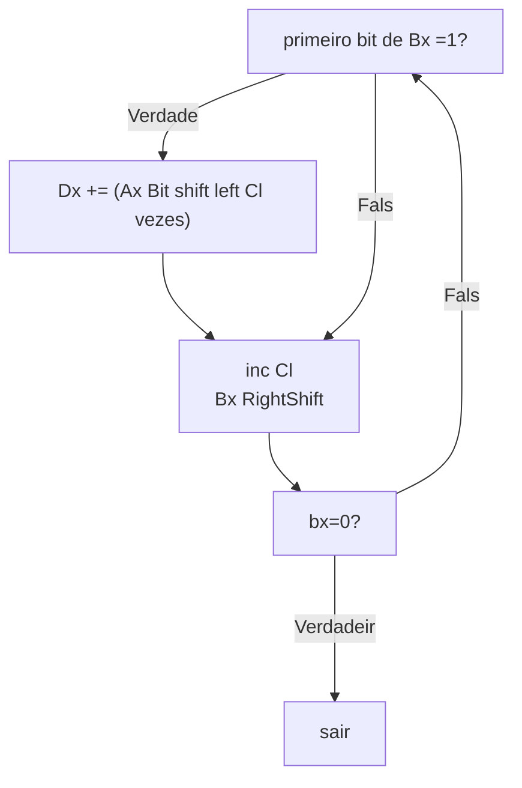

# Algoritmo
$Ax \times Bx = Dx$

## Vars iniciais 

$Ax=$ numero maior
$Bx =$ numero menor
$Cl=$ conta os ciclos
$Dx=$ Guarda o resultado

### Algoritmo

```mermaid
graph
a[primeiro bit de Bx =1?]-- Verdade -->B["Dx += (Ax Bit shift left Cl vezes)"];
B-->c[inc Cl <br/> Bx RightShift ];
c-->d[bx=0?]
d--Falso-->a
a--Falso-->c
d--Verdadeiro-->e[sair]
```
